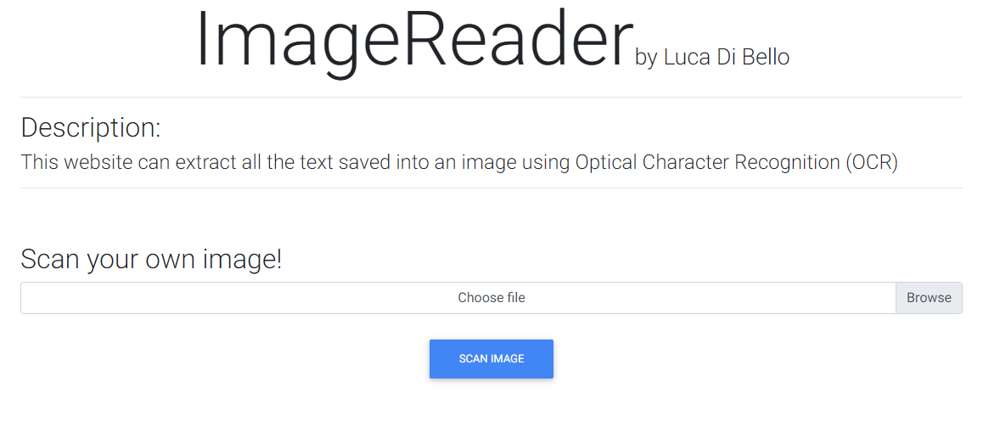
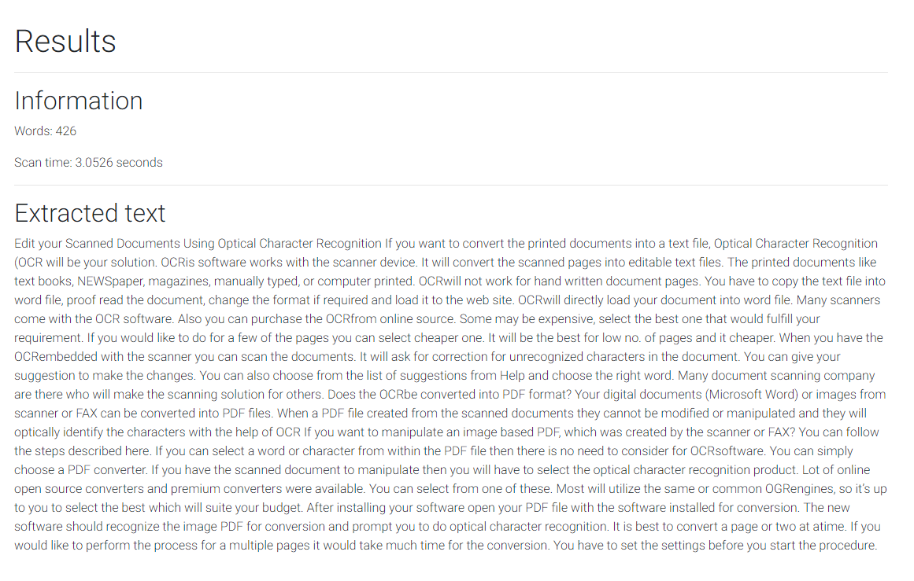

<<<<<<< HEAD
# ImageReader
This website is able to read all the text written in an image using OCR (Optical Character Recognition).
It uses Flask (back-end) and as front-end framework Material Design Bootstrap (jQuery edition).

## Homepage


## Scan results


# Setup
## Install requirements
### UNIX
```bash
pip3 install -r requirements.txt
```

### Windows
```bash
pip install -r requirements.txt
```


## Setup Tesseract path
Insert Tesseract file path in main.py (line 54):

```python
# Example: r'D:\TesseractOCR\tesseract'
pytesseract.pytesseract.tesseract_cmd = r'<path_to_tesseract_exe>'
```

# Start Flask webserver
## UNIX
```'bash
python3 main.py
```

## Windows
```bash
python main.py
```

PS: The webserver will start on the port 5000
=======
# ImageReader
This website is able to read all the text written in an image using OCR (Optical Character Recognition).
It uses Flask (back-end) and as front-end framework Material Design Bootstrap (jQuery edition) and Jinja2 (page templating language for Python).

## Homepage


## Scan results


# Setup
## Install requirements
### UNIX
```bash
pip3 install -r requirements.txt
```

### Windows
```bash
pip install -r requirements.txt
```


## Setup Tesseract path
Insert Tesseract file path in main.py (line 54):

```python
# Example: r'D:\TesseractOCR\tesseract'
pytesseract.pytesseract.tesseract_cmd = r'<path_to_tesseract_exe>'
```

# Start Flask webserver
## UNIX
```'bash
python3 main.py
```

## Windows
```bash
python main.py
```

PS: The webserver will start on the port 5000
>>>>>>> 801ceb7d90526e7d209854a93f08ac89680e349d
